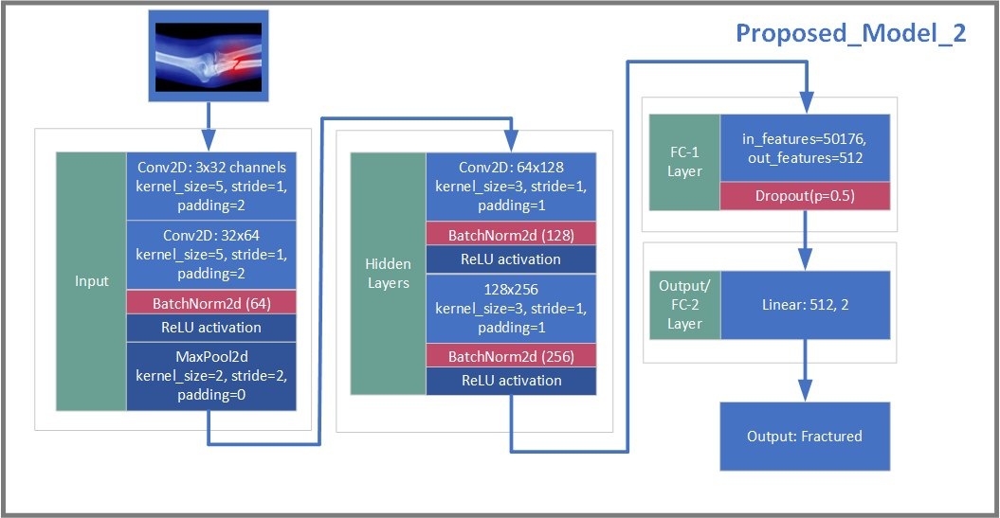

# CM2-Net-Model
-A custom model is released named "CM2-Net". </br> 
-You can use this model for your any computer vision and image processing project.</br>
-This repository contains one custom CNN models developed for automatic bone fracture detection from X-ray images, as presented in our paper.
<hr>

<h4 align="center"><strong><a href="https://doi.org/10.1007/978-3-031-82156-1_1">Publication: Springer Nature</a></strong></h4>
<h4 align="center"><strong><a href="https://doi.org/10.1007/978-3-031-82156-1_1">Conference: ISPR'2024, Istanbul City, Turkey</a></strong></h4>
<h3 align="center"><strong>A Bone Fracture Detection Using CNN Model (<strong><a href="https://doi.org/10.1007/978-3-031-82156-1_1">Paper</a>)</strong></h3>

<h6 align="center">Afsana-Nadia<sup> 1</sup>,  Md. Nuruzzaman<sup> 1</sup>,  Khan Md. Shibli Nomani<sup> 1, </sup>, Md. Masum Billal<sup> 1</sup></h6>
<h6 align="center">|| 1. Researcher, Aerofinity AI Lab || </h6>
<hr>

### NOTICE: 
- Trained weights will be uploaded soon.
- The proposed CM2-Net code will be uploaded soon.

## Our Proposed Model: CM2-Net


## Custom License:

"Redistribution and use, with or without modification, are permitted provided that the following conditions are met: Any publication or software which uses this model must cite the following paper: Nadia, A., Nuruzzaman, M., Nomani, K.M.S., Billal, M.M. (2025). A Bone Fracture Detection Using CNN Model. In: Bennour, A., Bouridane, A., Almaadeed, S., Bouaziz, B., Edirisinghe, E. (eds) Intelligent Systems and Pattern Recognition. ISPR 2024. Communications in Computer and Information Science, vol 2305. Springer, Cham. https://doi.org/10.1007/978-3-031-82156-1_1"

## Cite this Paper:

If you use this custom model in academic work or research or application, you must cite the associated publication: 

```
Nadia, A., Nuruzzaman, M., Nomani, K.M.S., Billal, M.M. (2025). A Bone Fracture Detection Using CNN Model. In: Bennour, A., Bouridane, A., Almaadeed, S., Bouaziz, B., Edirisinghe, E. (eds) Intelligent Systems and Pattern Recognition. ISPR 2024. Communications in Computer and Information Science, vol 2305. Springer, Cham. https://doi.org/10.1007/978-3-031-82156-1_1
